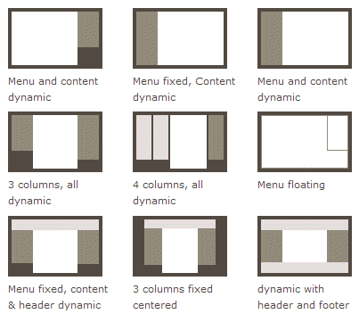

# Flex应用场景

> 资源来源于网络

## 网页布局（layout）是 CSS 的一个重点应用。

* 布局的传统解决方案，基于[盒状模型](https://developer.mozilla.org/en-US/docs/Web/CSS/box_model)，依赖 [`display`](https://developer.mozilla.org/en-US/docs/Web/CSS/display) 属性 + [`position`](https://developer.mozilla.org/en-US/docs/Web/CSS/position)属性 + [`float`](https://developer.mozilla.org/en-US/docs/Web/CSS/float)属性。它对于那些特殊布局非常不方便，比如，[垂直居中](https://css-tricks.com/centering-css-complete-guide/)就不容易实现。

* 2009年, W3C提出一个新方案: Flex布局
* 可简更加的简单的实现,响应式的布局, 并且得到了几乎所有浏览器的支持, 所以请放心大胆的用吧

* 所以, Flex必将成为未来布局的首选方案, 下节课咱们就来详细介绍一下它的基本语法知识
