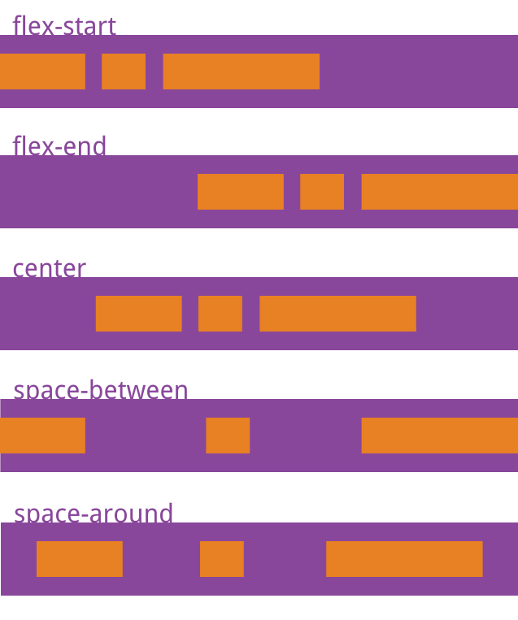
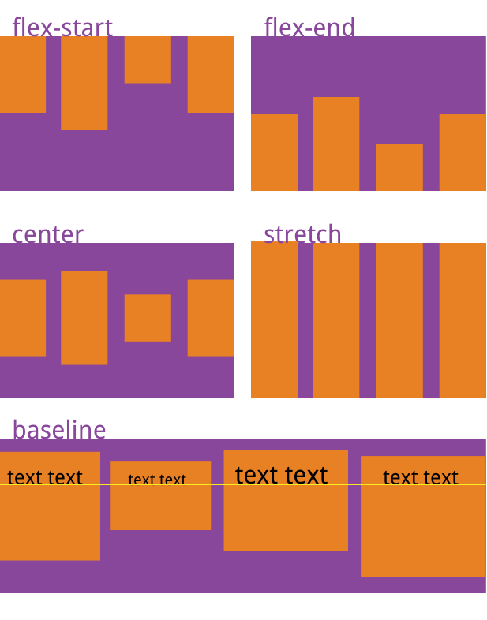

# Flex容器属性

> 资源来源于网络

**容器属性汇总:**

| 序号 | 属性            | 描述                                             |
| :--: | :-------------- | :----------------------------------------------- |
|  1   | flex-direction  | 主轴方向(即项目排列方向)                         |
|  2   | flex-wrap       | 当多个项目在一行排列不下时,如何换行              |
|  3   | flex-flow       | flex-direction,flex-wrap的简写,默认:`row nowrap` |
|  4   | justify-content | 项目在主轴上对齐方式                             |
|  5   | align-items     | 项目在交叉轴上的对齐方式                         |
|  6   | align-content   | 项目在多根轴线上的对齐方式,只有一根轴线无效      |

---

## 1. flex-direction

* **功能**: 决定项目在主轴上的排列方向
* 它有四个可能的值:

| 序号 | 属性值         | 描述                             |
| ---- | -------------- | -------------------------------- |
| 1    | row 默认值     | 主轴为水平方向,起点在左边        |
| 2    | row-reverse    | 主轴为水平方向, 起点在右边(反转) |
| 3    | column         | 主轴为垂直方向, 起点在上边       |
| 4    | column-reverse | 主轴为垂直方向, 起点在下边       |

* CSS语法:

```css
.container {
  display: flex;
  flex-direction: row | row-reverse | column | column-reverse;
}
```

* 示意图:


---

## 2. flex-wrap

* **功能**: 多个项目默认排列在一根轴线上,该属性定义了当一根轴线排列不下时,多作的项目的换行方式

| 序号 | 属性值        | 描述                                       |
| ---- | ------------- | ------------------------------------------ |
| 1    | nowrap 默认值 | 不换行                                     |
| 2    | wrap          | 自动换行, 第一行排列不下, 自动转到下一行   |
| 3    | wrap-reverse  | 自动反向换行, 第一行显示在下方, 与wrap相反 |


* CSS语法

```css
.container {
  display: flex;
  flex-wrap: nowrap | wrap | wrap-reverse;
}
```

* 属性值说明:

  * `nowrap`: (默认值)不换行

  

  * `wrap`: 自动换行

  

  * `wrap-reverse`: 自动反向换行

  

---

## 3. flex-flow

flex-flow属性是flex-direction属性和flex-wrap属性的简写形式，默认值为`row nowrap`

```css
.container {
  display: flex;
  flex-flow: [flex-direction] || [flex-wrap];
  /*默认*/
  flex-flow: row nowrap;
}
```

---

## 4. justity-content

* **功能**: 设置项目在主轴上的对齐方式
* CSS语法:

```css
.container {
  display: flex;
  justify-content: flex-start | flex-end | center | space-between | space-around;
}
```

* 属性值说明

| 序号 | 属性值            | 描述                                              |
| ---- | ----------------- | ------------------------------------------------- |
| 1    | flex-start 默认值 | 左对齐                                            |
| 2    | flex-end          | 右对齐                                            |
| 3    | center            | 居中对齐                                          |
| 4    | space-between     | 两端对齐: 项目之间间隔相等                        |
| 5    | space-around      | 项目两侧间隔相等,即项目之间间隔是项目到两端的二倍 |
| 6    | space-evenly      | 平均分配主轴上的剩余空间                          |

* 示意图:



---

## 5. align-items

* **功能:** 该属性设置项目在交叉轴上的对齐方式
* CSS语法:

```css
.container {
  display: flex;
  align-items: flex-start | flex-end | center | baseline | stretch;
}
```

* 属性值说明:

| 序号 | 属性值         | 描述                                                       |
| ---- | -------------- | ---------------------------------------------------------- |
| 1    | flex-start     | 与交叉轴起点对齐, 即: 顶对齐 / 上对齐                      |
| 2    | flex-end       | 与交叉轴终点对齐, 即: 底对齐 / 下对齐                      |
| 3    | center         | 与交叉轴中间线对齐, 即: 居中对齐                           |
| 4    | baseline       | 与项目中第一行文本的基线对齐, 即文本的下边线               |
| 5    | stretch 默认值 | 自动伸展到容器的高度(项目未设置高度或将高度设置为auto有效) |

* 示意图:



---

## 6. align-content

* `align-items`和`align-content`有相同的功能，不过不同点是它是用来让每一个单行的容器居中而不是让整个容器居中
* `align-content`属性只适用于**多行**的flex容器，并且当交叉轴上有多余空间使flex容器内的flex线对齐
* `align-items`属性适用于所有的flex容器，它是用来设置每个flex元素在交叉轴上的默认对齐方式
* 该属性的重点,在于**多行项目**, 这是与`align-items`最重要的区别
* CSS语法:

```css
.container {
  display: flex;
  align-content: flex-start | flex-end | center | space-between | space-around | stretch;
}
```

* 属性值说明:

| 序号 | 属性值         | 描述                                        |
| ---- | -------------- | ------------------------------------------- |
| 1    | flex-start     | 与交叉轴起点对齐                            |
| 2    | flex-end       | 与交叉轴终点对齐                            |
| 3    | center         | 与交叉轴中间点对齐                          |
| 4    | space-between  | 与交叉轴两端对齐, 轴线之间间隔相等          |
| 5    | sapce-around   | 每根轴线间隔相等,轴线间隔比轴线到边框大一倍 |
| 6    | stretch 默认值 | 轴线占满整个交叉轴                          |

* 示意图:


---

## 总结

一个弹性盒子容器的默认状态如下:

```css
.container {
  /*弹性布局*/
  display: flex;
  
  /*以下弹性盒子容器全部属性以及默认值,即弹性盒子的默认状态*/
  
  /*1. 主轴方向: 行(水平)*/
  flex-direction: row;
  
  /*2. 多个项目换行方式: 不换行*/
  flex-wrap: nowrap;
  
  /*3. 多个项目在主轴上的排列与换行方式的简写*/
  flex-flow: row nowrap;
  
  /*4. 多个项目在主轴上的对齐方式: 左对齐*/
  justify-content: flex-start;
  
  /*5. 多个项目在交叉轴上的对齐方式: 自动伸展到容器高度*/
  align-item: stretch;
  
  /*6. 多个项目分为多行时, 在交叉轴上排列方式: 充满整个交叉轴*/
  align-content: stretch;
}
```

