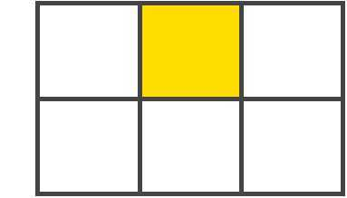
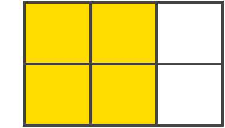

> 资源来源于网络

# 重要术语


在深入了解网格的概念之前，理解术语是很重要的。 由于这里所涉及的术语在概念上都是相似的，如果不先记住它们在网格规范中定义的含义，则很容易将它们彼此混淆。 但是不用太担心，这些术语并不多。


## 1 网格容器`Grid Container`

设置了 `display: gird` 的元素。 这是所有 grid item 的直接父项。 在下面的例子中，`.container` 就是是 grid container。

```html
<div class="container">
  <div class="item item-1"></div>
  <div class="item item-2"></div>
  <div class="item item-3"></div>
</div>
```


## 2 网格项目`Grid Item`

Grid 容器的孩子（直接子元素）。下面的 `.item` 元素就是 grid item，但 `.sub-item`不是

```html
<div class="container">
  <div class="item"></div> 
  <div class="item">
    <p class="sub-item"></p>
  </div>
  <div class="item"></div>
</div>
```

## 3 网格线`Grid Line`

这个分界线组成网格结构。 它们既可以是垂直的（“column grid lines”），也可以是水平的（“row grid lines”），并位于行或列的任一侧。 下面例中的黄线就是一个列网格线


## 4 网格轨道`Grid Track`

两个相邻网格线之间的空间。 你可以把它们想象成网格的列或行。 下面是第二行和第三行网格线之间的网格轨道


## 5 网格单元`Grid Cell`

两个相邻的行和两个相邻的列网格线之间的空间。它是网格的一个“单元”。 下面是行网格线1和2之间以及列网格线2和3的网格单元。



## 6 网格区域`Grid Area`

四个网格线包围的总空间。 网格区域可以由任意数量的网格单元组成。 下面是行网格线1和3以及列网格线1和3之间的网格区域



------

## 7. Grid 属性列表

### 7.1 Grid Container 的全部属

* display
* grid-template-columns
* grid-template-rows
* grid-template-areas
* grid-template
* grid-column-gap
* grid-row-gap
* grid-gap
* justify-items
* align-items
* justify-content
* align-content
* grid-auto-columns
* grid-auto-rows
* grid-auto-flow
* grid

### 7.2 Grid Items 的全部属性

* grid-column-start
* grid-column-end
* grid-row-start
* grid-row-end
* grid-column
* grid-row
* grid-area
* justify-self
* align-self