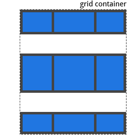
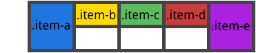

> 资源来源于网络

# 父容器(Grid Container)的属性


## 1 display

将元素定义为 grid contaienr，并为其内容建立新的网格格式化上下文(grid formatting context)。

值:

* `grid`:  生成一个块级(block-level)网格
* `inline-grid`:  生成一个行级(inline-level)网格
* `subgrid`:  如果你的 grid container 本身就是一个 grid item（即,嵌套网格），你可以使用这个属性来表示你想从它的父节点获取它的行/列的大小，而不是指定它自己的大小。

```css
.container {
  display: grid | inline-grid | subgrid;
}
```

注意：`column`, `float`, `clear`, 以及 `vertical-align` 对一个 grid container 没有影响

## 2 grid-template-columns / grid-template-rows

使用以空格分隔的多个值来定义网格的列和行。这些值表示轨道大小(track size)，它们之间的空格代表表格线(grid line)。

```css
.container {
  grid-template-columns: <track-size> ... | <line-name> <track-size> ...;
  grid-template-rows: <track-size> ... | <line-name> <track-size> ...;
}
```

例子:

(如果未显示的给网格线命名)，**轨道值之间仅仅有空格时，网格线会被自动分配数字名称**：

```css
.container {
  grid-template-columns: 40px 50px auto 50px 40px;
  grid-template-rows: 25% 100px auto;
}
```


但你可以给网格线指定确切的命名。 注意中括号里的网格线命名语法：

```css
.container {
  grid-template-columns: [first] 40px [line2] 50px [line3] auto [col4-start] 50px [five] 40px [end];
  grid-template-rows: [row1-start] 25% [row1-end] 100px [third-line] auto [last-line];
}
```


需要注意的是，一个网格线可以有不止一个名字。例如，这里第2条网格线有两个名字：row1-end 和 row2-start：

```css
.container {
  grid-template-rows: [row1-start] 25% [row1-end row2-start] 25% [row2-end];
}
```

如果你的定义中包含重复的部分，则可以使用`repeat()` 符号来简化写法：

```css
.container {
  grid-template-columns: repeat(3, 20px [col-start]) 5%;
}

/* 等价于 */

.container {
  grid-template-columns: 20px [col-start] 20px [col-start] 20px [col-start] 5%;
}
```

**“fr”**单位允许您将轨道大小设置为网格容器自由空间的一部分。 例如，下面的代码会将每个 grid item 为 grid container 宽度的三分之一：

```css
.container {
  grid-template-columns: 1fr 1fr 1fr;
}
```

自由空间是在排除所有不可伸缩的 grid item 之后计算得到的。 在下面的示例中，fr单位可用的自由空间总量不包括50px:

```css
.container {
  grid-template-columns: 1fr 50px 1fr 1fr;
}
```

-----

## 3. grid-template-areas

通过引用 `grid-area`属性指定的网格区域的名称来定义网格模板。 重复网格区域的名称导致内容扩展到这些单元格。 点号表示一个空单元格。 语法本身提供了网格结构的可视化。

值：

* `<grid-area-name>` – 使用 grid-area 属性设置的网格区域的名称
* `.` – 点号代表一个空网格单元
* **none** – 没有定义网格区域

举例：

```css
.item-a {
  grid-area: header;
}
.item-b {
  grid-area: main;
}
.item-c {
  grid-area: sidebar;
}
.item-d {
  grid-area: footer;
}

.container {
  grid-template-columns: 50px 50px 50px 50px;
  grid-template-rows: auto;
  grid-template-areas: 
    "header header header header"
    "main main . sidebar"
    "footer footer footer footer";
}
```

这将创建一个四列宽三行高的网格。 整个第一行将由 **header** 区域组成。 中间一行将由两个 **main** 区域、一个空单元格和一个 **sidebar** 区域组成。 最后一行是**footer**区域组成。


* 你的声明中的每一行都需要有相同数量的单元格。

* 您可以使用任意数量的相邻的`.`来声明单个空单元格。 只要这些点号之间没有空格，他们就代表了一个单一的单元格。

* 需要注意的是你不是在用这个语法命名网格线，而是在命名区域。 当你使用这种语法时，区域两端的网格线实际上是自动命名的。 比如，如果网格区域的名称是foo，那么区域的起始的行网格线和列网格线名称是 foo-**start**，并且区域终点的行网格线和列网格线名称是 foo-**end**。 这意味着某些网格线可能有多个名称，比如上面的例子中最左边的一条网格线有三个名字：header-start，main-start 和 footer-start。

----

## 4. grid-template

在单个声明中定义 grid-template-rows、grid-template-columns、grid-template-areas 的简写。

值：

* **none** – 将三个属性都设置为其初始值
* **subgrid** – 把 grid-template-rows 和 grid-template-columns 设置为 subgrid, 并且 grid-template-areas 设置为初始值
* `grid-template-rows` / `<grid-template-columns` – 把 grid-template-columns 和 grid-template-rows 设置为指定值, 与此同时, 设置 grid-template-areas 为 none

```css
.container {
  grid-template: none | subgrid | <grid-template-rows> / <grid-template-columns>;
}
```

它也可以使用一个更复杂但相当方便的语法来指定这三个值。 一个例子：

```css
.container {
  grid-template:
    [row1-start] "header header header" 25px [row1-end]
    [row2-start] "footer footer footer" 25px [row2-end]
    / auto 50px auto;
}

/* 等价于 */

.container {
  grid-template-rows: [row1-start] 25px [row1-end row2-start] 25px [row2-end];
  grid-template-columns: auto 50px auto;
  grid-template-areas: 
    "header header header" 
    "footer footer footer";
}
```

由于 grid-template 不会重置隐式网格属性（`grid-auto-columns`，`grid-auto-rows`和`grid-auto-flow`），而这可能是大多数情况下你想要做的。因此建议使用`grid`属性来代替`grid-template`。

---

## 5. grid-column-gap / grid-row-gap

指定网格线的大小，你可以把它想象为设置列/行之间的间距的宽度。

值：

* `line-size` – 一个长度值

```css
.container {
  grid-column-gap: <line-size>;
  grid-row-gap: <line-size>;
}
```

举例：

```css
.container {
  grid-template-columns: 100px 50px 100px;
  grid-template-rows: 80px auto 80px; 
  grid-column-gap: 10px;
  grid-row-gap: 15px;
}
```


> 只能在列/行之间创建缝隙，而不是在外部边缘创建

-------

## 6. grid-gap

grid-row-gap 和 grid-column-gap 的缩写

```css
.container {
  grid-gap: <grid-row-gap> <grid-column-gap>;
}
```

Example:

```css
.container {
  grid-template-columns: 100px 50px 100px;
  grid-template-rows: 80px auto 80px; 
  grid-gap: 10px 15px;
}
```

如果没有指定 grid-row-gap，则会被设置为与 grid-column-gap 相同的值。

-----

## 7. justify-items

沿着行轴对齐网格内的内容（与之对应的是 align-items, 即沿着列轴对齐），该值适用于容器内的所有的 grid items。

值：

* **start**: 内容与网格区域的左端对齐
* **end**: 内容与网格区域的右端对齐
* **center**: 内容位于网格区域的中间位置
* **stretch**: 内容宽度占据整个网格区域空间(这是默认值)

```css
.container {
  justify-items: start | end | center | stretch;
}
```

举例：

```css
.container {
  justify-items: start;
}
```


```css
.container{
  justify-items: end;
}
```


```css
.container {
  justify-items: center;
}
```


```css
.container {
  justify-items: stretch;
}
```


**也可以通过给单个 grid item 设置`justify-self`属性来达到上述效果。**

-----

## 8. align-items

沿着列轴对齐grid item 里的内容（与之对应的是使用 justify-items 设置沿着行轴对齐），该值适用于容器内的所有 grid items。

值：

* **start**: 内容与网格区域的顶端对齐
* **end**: 内容与网格区域的底部对齐
* **center**: 内容位于网格区域的垂直中心位置
* **stretch**: 内容高度占据整个网格区域空间(这是默认值)

```css
.container {
  align-items: start | end | center | stretch;
}
```

举例:

```css
.container {
  align-items: start;
}
```


```css
.container {
  align-items: end;
}
```


```css
.container {
  align-items: center;
}
```


```css
.container {
  align-items: stretch;
}
```


也可以通过给单个 grid item 设置`align-self`属性来达到上述效果。

---

## 9. justify-content

有时，网格的总大小可能小于其网格容器的大小。如果你的所有 grid items 都使用像px这样的非弹性单位来设置大小，则可能发生这种情况。此时，你可以设置网格容器内的网格的对齐方式。 此属性沿着行轴对齐网格（与之对应的是 align-content, 沿着列轴对齐）。

值：

* start – 网格与网格容器的左边对齐
* end – 网格与网格容器的右边对齐
* center – 网格与网格容器的中间对齐
* stretch – 调整g rid item 的大小，让宽度填充整个网格容器
* space-around – 在 grid item 之间设置均等宽度的空白间隙，其外边缘间隙大小为中间空白间隙宽度的一半
* space-between – 在 grid item 之间设置均等宽度空白间隙，其外边缘无间隙
* space-evenly – 在每个 grid item 之间设置均等宽度的空白间隙，包括外边缘

```css
.container {
  justify-content: start | end | center | stretch | space-around | space-between | space-evenly;  
}
```

举例：

```css
.container {
  justify-content: start;
}
```


```css
.container {
  justify-content: end; 
}
```


```css
.container {
  justify-content: center;  
}
```


```css
.container {
  justify-content: stretch; 
}
```


```css
.container {
  justify-content: space-around;  
}
```


```css
.container {
  justify-content: space-between; 
}
```


```css
.container {
  justify-content: space-evenly;  
}
```


---

## 10. align-content

有时，网格的总大小可能小于其网格容器的大小。如果你的所有 grid items 都使用像px这样的非弹性单位来设置大小，则可能发生这种情况。此时，你可以设置网格容器内的网格的对齐方式。 此属性沿着列轴对齐网格（与之对应的是 justify-content, 即沿着行轴对齐）。

值：

* start – 网格与网格容器的顶部对齐
* end – 网格与网格容器的底部对齐
* center – 网格与网格容器的中间对齐
* stretch – 调整 grid item 的大小，让高度填充整个网格容器
* space-around – 在 grid item 之间设置均等宽度的空白间隙，其外边缘间隙大小为中间空白间隙宽度的一半
* space-between – 在 grid item 之间设置均等宽度空白间隙，其外边缘无间隙
* space-evenly – 在每个 grid item 之间设置均等宽度的空白间隙，包括外边缘

```css
.container {
  align-content: start | end | center | stretch | space-around | space-between | space-evenly;  
}
```

举例：

```css
.container {
  align-content: start; 
}
```


```css
.container {
  align-content: end; 
}
```


```css
.container {
  align-content: center;  
}
```


```css
.container {
  align-content: stretch; 
}
```


```css
.container {
  align-content: space-around; 
}
```


```css
.container {
  align-content: space-between; 
}
```



```css
.container {
  align-content: space-evenly;  
}
```


---

## 11. grid-auto-columns / grid-auto-rows

指定自动生成的网格轨道（又名隐式网格轨道）的大小。 隐式网格轨道在你显式的定位超出指定网格范围的行或列（使用 grid-template-rows/grid-template-columns）时被创建。

值：

* `<track-size>` – 可以是一个长度值，一个百分比值，或者一个自由空间的一部分（使用 fr 单位）

```css
.container {
  grid-auto-columns: <track-size> ...;
  grid-auto-rows: <track-size> ...;
}
```

为了说明如何创建隐式网格轨道，思考如下代码：

```css
.container {
  grid-template-columns: 60px 60px;
  grid-template-rows: 90px 90px
}
```


这里创建了一个 2×2的网格。

但是，现在想象一下，使用 grid-column 和 grid-row 来定位你的网格项目，如下所示：

```css
.item-a {
  grid-column: 1 / 2;
  grid-row: 2 / 3;
}
.item-b {
  grid-column: 5 / 6;
  grid-row: 2 / 3;
}
```


这里我们指定 .item-b开始于列网格线 5 并结束于在列网格线 6，但我们并未定义列网格线 5 或 6。因为我们引用不存在的网格线，宽度为0的隐式轨道的就会被创建用与填补间隙。我们可以使用 grid-auto-columns 和 grid-auto-rows属性来指定这些隐式轨道的宽度：

```css
.container {
  grid-auto-columns: 60px;
}
```


---

## 12. grid-auto-flow

如果你存在没有显示指明放置在网格上的 grid item，则自动放置算法会自动放置这些项目。 而该属性则用于控制自动布局算法的工作方式。

值：

* row – 告诉自动布局算法依次填充每行，根据需要添加新行
* column – 告诉自动布局算法依次填充每列，根据需要添加新列
* dense – 告诉自动布局算法，如果后面出现较小的 grid item，则尝试在网格中填充空洞

```css
.container {
  grid-auto-flow: row | column | row dense | column dense
}
```

需要注意的是，`dense` 可能导致您的 grid item 乱序。

举例， 考虑如下 HTML：

```html
<section class="container">
  <div class="item-a">item-a</div>
  <div class="item-b">item-b</div>
  <div class="item-c">item-c</div>
  <div class="item-d">item-d</div>
  <div class="item-e">item-e</div>
</section>
```

当把 grid item 放在网格上时，你只把其中两个设置了固定的位置：

```css
.item-a {
  grid-column: 1;
  grid-row: 1 / 3;
}
.item-e {
  grid-column: 5;
  grid-row: 1 / 3;
}
```

因为我们将 grid-auto-flow 设置为row，所以我们的grid就像这样。 注意观察我们没有做设置的三个项目（item-b，item-c和item-d）是如何在剩余的行水平摆放位置的：



如果我们将 grid-auto-flow 设置为 column，则 item-b，item-c 和 item-d 以列的顺序上下摆放：


---

## 13. grid

在单个属性中设置所有以下属性的简写：grid-template-rows，grid-template-columns，grid-template-areas，grid-auto-rows，grid-auto-columns和grid-auto-flow。 它同时也将 sets grid-column-gap 和 grid-row-gap 设置为它们的初始值，即使它们不能被此属性显示设置。

值：

* none – 将所有子属性设置为其初始值
* `<grid-template-rows>` / `<grid-template-columns>` – 将 grid-template-rows 和 grid-template-columns 分别设置为指定值，将所有其他子属性设置为其初始值
* `<grid-auto-flow>` [`<grid-auto-rows>` [ / `<grid-auto-columns>`] ] – 接受所有与grid-auto-flow，grid-auto-rows和grid-auto-columns相同的值。 如果省略grid-auto-columns，则将其设置为为grid-auto-rows指定的值。 如果两者都被省略，则它们被设置为它们的初始值

```css
.container {
    grid: none | <grid-template-rows> / <grid-template-columns> | <grid-auto-flow> [<grid-auto-rows> [/ <grid-auto-columns>]];
}
```

举例：

以下代码写法等价

```css
.container {
  grid: 200px auto / 1fr auto 1fr;
}
.container {
  grid-template-rows: 200px auto;
  grid-template-columns: 1fr auto 1fr;
  grid-template-areas: none;
}
```

以下代码写法等价

```css
.container {
  grid: column 1fr / auto;
}
.container {
  grid-auto-flow: column;
  grid-auto-rows: 1fr;
  grid-auto-columns: auto;
}
```

它也可用使用一个更复杂但相当方便的语法来一次设置所有内容。 你可以指定 grid-template-areas、grid-template-rows 以及 grid-template-columns，并将所有其他子属性设置为其初始值。 你现在所做的是在其网格区域内，指定网格线名称和内联轨道大小。 可以看下面的例子：

```css
.container {
  grid: [row1-start] "header header header" 1fr [row1-end]
        [row2-start] "footer footer footer" 25px [row2-end]
        / auto 50px auto;
}
```

上述代码等价于

```css
.container {
  grid-template-areas: 
    "header header header"
    "footer footer footer";
  grid-template-rows: [row1-start] 1fr [row1-end row2-start] 25px [row2-end];
  grid-template-columns: auto 50px auto;    
}
```

