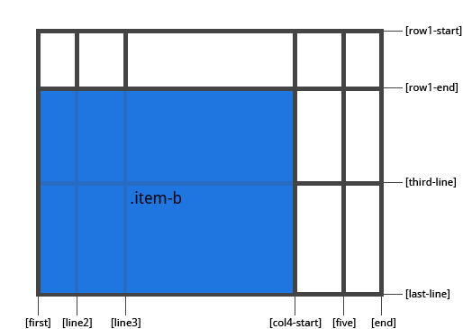
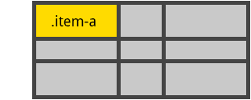

> 资源来源于网络

# Grid Items 属性


## 1.  grid-column-start / grid-column-end / grid-row-start /grid-row-end

使用特定的网格线确定 grid item 在网格内的位置。grid-column-start/grid-row-start 属性表示grid item的网格线的起始位置，grid-column-end/grid-row-end属性表示网格项的网格线的终止位置。

值：

* `<line>`: 可以是一个数字来指代相应编号的网格线，也可使用名称指代相应命名的网格线
* `span <number>`: 网格项将跨越指定数量的网格轨道
* `span <name>`: 网格项将跨越一些轨道，直到碰到指定命名的网格线
* auto: 自动布局， 或者自动跨越， 或者跨越一个默认的轨道

```css
.item {
  grid-column-start: <number> | <name> | span <number> | span <name> | auto
  grid-column-end: <number> | <name> | span <number> | span <name> | auto
  grid-row-start: <number> | <name> | span <number> | span <name> | auto
  grid-row-end: <number> | <name> | span <number> | span <name> | auto
}
```

举例：

```css
.item-a {
  grid-column-start: 2;
  grid-column-end: five;
  grid-row-start: row1-start
  grid-row-end: 3
}
```


```css
.item-b {
  grid-column-start: 1;
  grid-column-end: span col4-start;
  grid-row-start: 2
  grid-row-end: span 2
}
```



如果没有声明 grid-column-end / grid-row-end，默认情况下，该网格项将跨越1个轨道。

网格项可以相互重叠。 您可以使用z-index来控制它们的堆叠顺序。

---

## 2. grid-column / grid-row

grid-column-start + grid-column-end, 和 grid-row-start + grid-row-end 的简写形式。

值：

* `<start-line>` / `<end-line>` – 每个值的用法都和属性分开写时的用法一样

```css
.item {
  grid-column: <start-line> / <end-line> | <start-line> / span <value>;
  grid-row: <start-line> / <end-line> | <start-line> / span <value>;
}
```

举例：

```css
.item-c {
  grid-column: 3 / span 2;
  grid-row: third-line / 4;
}
```


**如果没有指定结束行值，则该网格项默认跨越1个轨道。**

---

## 3. grid-area

给 grid item 进行命名以便于使用 grid-template-areas 属性创建模板时来进行引用。另外也可以做为 grid-row-start + grid-column-start + grid-row-end + grid-column-end 的简写形式。

值：

* `<name>` – 你的命名
* `<row-start>` / `<column-start>` / `<row-end>` / `<column-end>` – 可以是数字，也可以是网格线的名字

```css
.item {
  grid-area: <name> | <row-start> / <column-start> / <row-end> / <column-end>;
}
```

举例:

给一个网格项命名

```css
.item-d {
  grid-area: header
}
```

作为 grid-row-start + grid-column-start + grid-row-end + grid-column-end 的简写:

```css
.item-d {
  grid-area: 1 / col4-start / last-line / 6
}
```


---

## 4. justify-self

沿着行轴对齐grid item 里的内容（与之对应的是 align-self, 即沿列轴对齐）。 此属性对单个网格项内的内容生效。

值：

* start – 将内容对齐到网格区域的左端
* end – 将内容对齐到网格区域的右端
* center – 将内容对齐到网格区域的中间
* stretch – 填充网格区域的宽度 (这是默认值)

举例：

```css
.item-a {
  justify-self: start;
}
```


```css
.item-a {
  justify-self: end;
}
```


```css
.item-a {
  justify-self: center;
}
```


要为网格中的所有grid items 设置对齐方式，也可以通过 justify-items 属性在网格容器上设置此行为。

---

## 5. align-self

沿着列轴对齐grid item 里的内容（与之对应的是 justify-self, 即沿行轴对齐）。 此属性对单个网格项内的内容生效。

值：

* start – 将内容对齐到网格区域的顶部
* end – 将内容对齐到网格区域的底部
* center – 将内容对齐到网格区域的中间
* stretch – 填充网格区域的高度 (这是默认值)

```css
.item {
  align-self: start | end | center | stretch;
}
```

举例:

```css
.item-a {
  align-self: start;
}
```


```css
.item-a {
  align-self: end;
}
```


```css
.item-a {
  align-self: center;
}
```


```css
.item-a {
  align-self: stretch;
}
```



要为网格中的所有grid items 统一设置对齐方式，也可以通过 align-items 属性在网格容器上设置此行为。