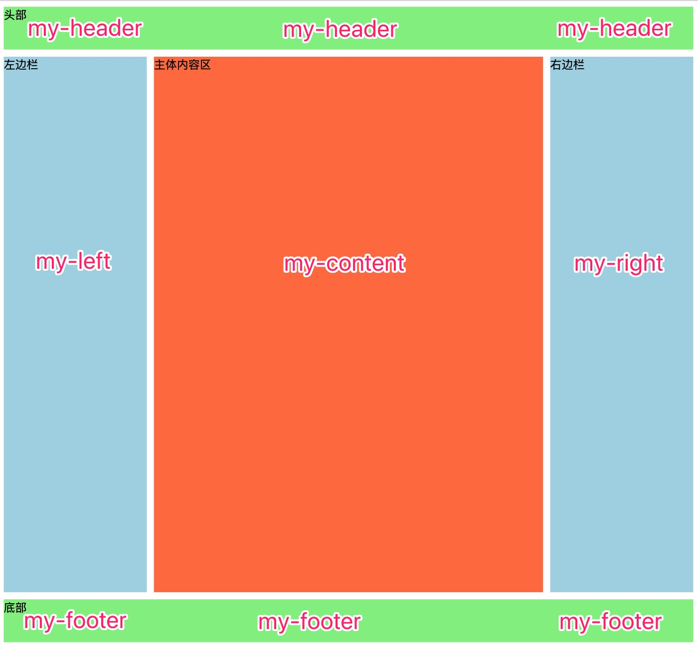

> 资源来源于网络

# 经典的三列布局

>  三列布局是基础, 可以方便的扩展为二列或多列


## 最终效果图



---

## HTML结构

```html
<!DOCTYPE html>
<html lang="en">
<head>
    <meta charset="UTF-8">
  	<link rel="stylesheet" href="style.css">
    <title>简单的三列布局</title>
</head>
<body>
<header class="header">头部</header>
<aside class="left">左边栏</aside>
<main class="content">主体内容区</main>
<aside class="right">右边栏</aside>
<footer class="footer">底部</footer>
</body>
</html>
```

---

## CSS代码

```css
/* style.css */
body {
  /*设置body元素采用网格布局*/
  display: grid;

  /*行模板: 第一行60px,第二行750px, 第三行60px*/
  grid-template-rows: 60px 750px 60px;

  /*列模板: 第一列200px,第2列自动扩展, 第3列200px*/
  grid-template-columns: 200px auto 200px;

  /*设置行间距:10px*/
  grid-row-gap: 10px;

  /*设置列间距: 10px*/
  grid-column-gap: 10px;
}

.header {
  /*网格区域命名*/
  grid-area: my-header;

  /*参考背景色*/
  background-color: lightgreen;
}
.footer {
  /*网格区域命名*/
  grid-area: my-footer;

  /*参考背景色*/
  background-color: lightgreen;
}

.left {
  /*网格区域命名*/
  grid-area: my-left;

  /*参考背景色*/
  background-color: lightblue;
}

.right {
  /*网格区域命名*/
  grid-area: my-right;

  /*参考背景色*/
  background-color: lightblue;
}

.content {
  /*网格区域命名*/
  grid-area: my-content;

  /*参考背景色*/
  background-color: coral;
}


/*设置网格区域: 非常直观*/
body {
  /*网格区域名称相同, 意味着合并*/
  grid-template-areas:
    "my-header  my-header   my-header"
    "my-left    my-content    my-right"
    "my-footer  my-footer   my-footer"
}
```

**看到这里不禁老泪纵横,世间万物都有轮回, 谁能料到,江湖上失传近20年的表格布局大法,会以这种方式回归**