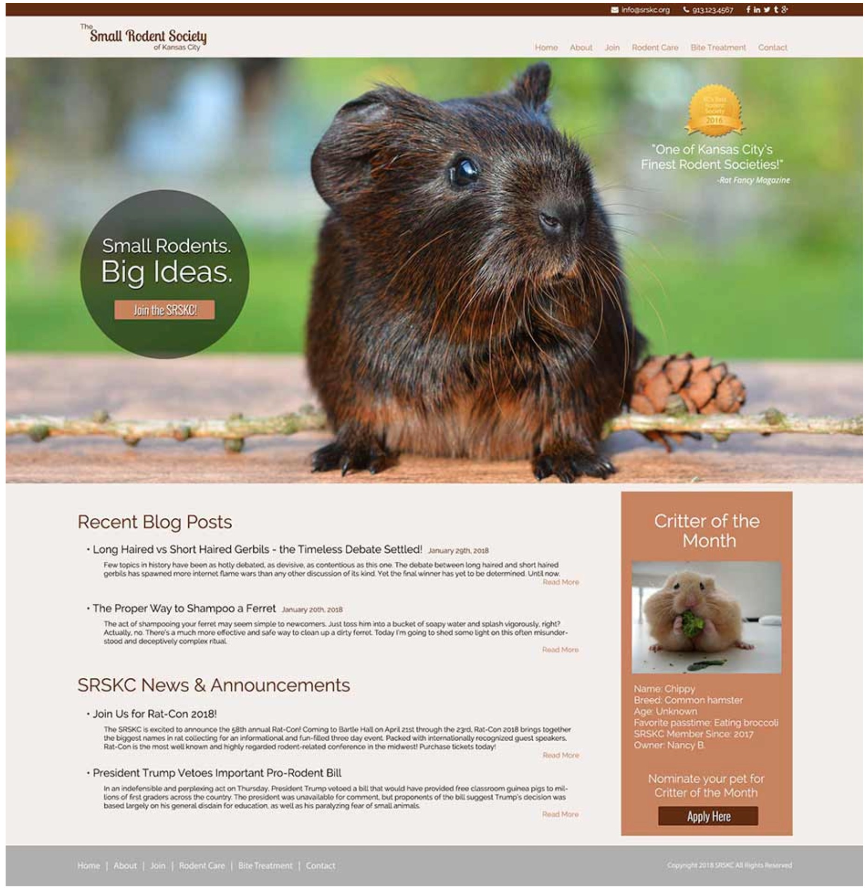

> 资源来源于网络


# 更实用的风格布局

这是一个较复杂的布局案例, 用到了媒体查询

## 效果图

### 原图




### 分析:


---

## HTML结构

```html
<!DOCTYPE html>
<html lang="en">
<head>
    <meta name="description" content="grid 主页" />
    <link rel="stylesheet" href="style.css">
    <meta charset="utf-8">
    <title>首页</title>
</head>
<body>

<header class="top-bar">
    top-bar
</header>

<header class="main-header">
    main-header
</header>

<section class="hero">
    <div class="message">
        message
    </div>
    <div class="award">
        award
    </div>
</section>

<section class="blog-posts">
    blog-posts
</section>

<section class="news">
    news
</section>

<aside class="side-bar">
    side-bar
</aside>

<footer class="main-footer">
    main-footer
</footer>

</body>
</html>
```

---

## CSS代码

```css
/* style.css */

body {
  display: grid;
  grid-template-columns: 12% auto 400px 12%;
  grid-template-rows: auto auto 300px auto auto auto;
  grid-template-areas:
    "top-bar     top-bar     top-bar     top-bar"
    "main-header main-header main-header main-header"
    "hero        hero        hero        hero"
    ".           blog-posts  side-bar    ."
    ".           news        side-bar    ."
    "main-footer main-footer main-footer main-footer";
  margin: 0;

  font-size: 1.5rem;
}

.top-bar{
  /*区域命名*/
  grid-area: top-bar;
  background-color: lightblue;
  padding: 4px 12%;
}
.main-header{
  grid-area: main-header;
  background-color: lightcoral;
  padding: 12px 12%;
}
.hero{
  grid-area: hero;
  background: lightseagreen;
  padding: 55px 12% 0 12%;

  display: grid;
  grid-template-columns: auto 1fr auto;
  grid-template-rows: auto auto auto;
  grid-template-areas:
    ".       .  award"
    "message .  .    "
    ".       .  .    ";
}
.blog-posts{
  grid-area: blog-posts;
  min-height: 200px;
  background-color: yellowgreen;
}
.news{
  grid-area: news;
  min-height: 200px;
  background-color: cyan;
}
.side-bar{
  grid-area: side-bar;
  background: #0e8;
}
.main-footer{
  grid-area: main-footer;
  background-color: lightblue;
  padding: 25px 12%;
}

.message{
  grid-area: message;
}
.award{
  grid-area: award;
}

/*媒体查询*/
@media (max-width: 1600px) {
  body{
    grid-template-columns: 2% auto 400px 2%;
  }
  .top-bar{
    padding: 4px 2%;
  }
  .main-header{
    padding: 12px 2%;
  }
  .hero{
    padding: 55px 2% 0 2%;
  }
  .main-footer{
    padding: 25px 2%;
  }
}

/*媒体查询*/
@media (max-width: 1050px) {
  body{
    grid-template-columns: 3% auto 3%;
    grid-template-rows: auto auto auto auto auto auto auto;
    grid-template-areas: "top-bar     top-bar     top-bar"
      "main-header main-header main-header"
      "hero        hero        hero"
      ".           blog-posts  ."
      ".           news        ."
      ".           side-bar    ."
      "main-footer main-footer main-footer";
  }
}
```

