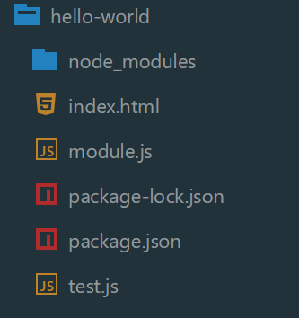

---

`webpack` 是一款模块加载器兼打包工具，它能够把各种资源，例如js（含JSX）、样式（含less/sass）、图片等都作为模块来使用和处理。

<!-- more -->

## 1.简介
`Webpack` 是一个模块打包器。根据模块的依赖关系进行静态分析，然后按照指定的规则将这些模块生成对应的静态资源。
相比于  `gulp`、`grunt` 等构件工具，`WebPack` 是一种模块化的解决方案，适合一些前后端分离项目的的场景，模块间依赖不强，
而 `gulp` 等工具侧重于资源压缩和自动化的构建，目前大型项目的开发，可以结合两者，协同工作。

这张官网图片，很好地展示了它的用途：


## 2.`Webpack` 的特点
- 代码拆分
Webpack 有两种组织模块依赖的方式，同步和异步。异步依赖作为分割点，形成一个新的块。在优化了依赖树后，每一个异步区块都作为一个文件被打包。

- Loader
Webpack 本身只能处理原生的 JavaScript 模块，但是 loader 转换器可以将各种类型的资源转换成 JavaScript 模块。这样，任何资源都可以成为 Webpack 可以处理的模块。

- 智能解析
Webpack 有一个智能解析器，几乎可以处理任何第三方库，无论它们的模块形式是 CommonJS、 AMD 还是普通的 JS 文件。甚至在加载依赖的时候，允许使用动态表达式 require("./templates/" + name + ".jade")。

- 插件系统
Webpack 还有一个功能丰富的插件系统。大多数内容功能都是基于这个插件系统运行的，还可以开发和使用开源的 Webpack 插件，来满足各式各样的需求。

- 快速运行
Webpack 使用异步 I/O 和多级缓存提高运行效率，这使得 Webpack 能够以令人难以置信的速度快速增量编译。

> 参考：[W3Cschool](https://www.w3cschool.cn/webpackguide/webpackguide-ewiz2775.html)

## 3.安装使用

### 3.1.安装

（1）、确保已安装 `Node.js` 环境，使用 `npm` 安装：
```bash
npm install webpack -g
```

（2）、在项目目录，进行初始化：
```bash
npm init
# 此时会生成 package.json
```

（3）、安装 `webpack` 依赖：
```bash
npm install webpack --save-dev
```

（4）、安装 `Webpack` 开发工具：
```bash
npm install webpack-dev-server --save-dev
```

### 3.2.简单使用

新建一个简单的项目 `hello-world`，目录结构如下：



（1）、`index.html` 内容如下：
```html
<!DOCTYPE html>
<html>
<head>
  <title>Webpack test</title>
</head>
<body>
  <div align="center">
     <h2><font color="blue">This is a test</font></h2>
     <span>Hello Webpack!</span>
     <h6>----------------------------------------</h6>
   </div> 
</body>
<script type="text/javascript" src="bundle.js"></script>
</html>
```

（2）、`module.js` 和 `test.js` 内容如下：
```js
// module.js
module.exports = '<div align="center"><h4>It works from module.js.</h4></div>'

// test.js
document.write(require('./module.js')) // 添加模块
document.write('<div align="center"><h3>webpack`s work is done.</h3></div>')


```

（3）、`package.json` 内容如下：
```json
{
  "name": "hello-world",
  "version": "1.0.0",
  "description": "webpack test",
  "main": "test.js",
  "scripts": {
    "test": "echo \"Error: no test specified\" && exit 1",
    "dev": "webpack test.js bundle.js"
  },
  "author": "Mr. Yao",
  "license": "ISC",
  "devDependencies": {
    "webpack": "^4.42.1"
  },
  "dependencies": {}
}

```

（4）、新建 `webpack.config.js` 文件：
```js
module.exports = {
  // 入口文件
  entry:  __dirname + "/test.js", //
  // 输出文件
  output: {
    path: __dirname + "/", 
    filename: "bundle.js" //打包后的输出文件名
  },
  mode: 'development'
}
```

（5）、运行打包命令：
```bash
npm run dev
```

页面显示：


## 4.`Webpack` 核心

**<font face="楷体" color="green">核心概念</font>**：
- <font face="华文行楷" color="green">入口(entry)</font>：<font face="华文行楷">指示 webpack 应该使用哪个模块，以及模块和库是入口起点</font>
- <font face="华文行楷" color="green">输出(output)</font>：<font face="华文行楷">告诉 webpack 在哪里输出它所创建的目标文件，以及如何命名。</font>
- <font face="华文行楷" color="green">加载转换(loader)</font>：<font face="华文行楷">让 webpack 能够去处理其他类型的文件，并将它们转换为可识别的模块</font>
- <font face="华文行楷" color="green">插件(plugin)</font>：<font face="华文行楷">用于执行范围更广的任务（扩展）。包括：打包优化，资源管理，注入环境变量。</font>
- <font face="华文行楷" color="green">模式(mode)</font>：<font face="华文行楷">通过选择 development, production 或 none 之中的一个，来设置 mode 参数</font>

### 4.1.常用 `Loader`

1. 样式： `css-loader`、`style-loader`、`less-loader`、`sass-loader`等

- `scss` 样式处理
```js
// webpack.config.js
{
  // ...
  module: {
    rules: [
      {
        test: /\.scss$/,
        use:[
          {loader:'style-loader'},
          {loader:'css-loader',options:{sourceMap:true,modules:true}},
          {loader:'sass-loader',options:{sourceMap:true}}
        ],
        exclude:/node_modules/
      }
    ]
  }
  // ...
}
```

- `postcss-loader/autoprefixer`: 浏览器兼容考虑，将前缀补充交由`webpack` 完成
```js
// postcss.config.js
module.exports = {
  plugins: [
    // 需要使用的插件列表
    require('autoprefixer'),
  ]
}

// webpack.config.js
{
  // ...
  module:{
    rules: [
      {
        test: /\.css$/,
        use: ['style-loader', 'css-loader', 'postcss-loader']
      },
      // ...
    ]
  },
  // ...
}
```
2. 文件：`raw-loader`、`file-loader`、`json-loader` 、`url-loader`等
3. 编译：`babel-loader`、`coffee-loader` 、`ts-loader`等
4. 校验：`mocha-loader`、`jshint-loader` 、`eslint-loader`等

> 参考： [webpack之 loader 和 plugin 简介](https://juejin.im/post/5980752ef265da3e2e56e82e)

### 4.2.常用 `plugin`

在配置文件 `webpack.config.js` 中，`plugins` 是一个插件组成的数组。 数组中的插件对象是插件new出来的实例。
**用法**：
```js
plugins:[plugin1,plugin2, ...]
```

*e.g.*：
```js
plugins: [
    new webpack.optimize.UglifyJsPlugin(),
    new HtmlWebpackPlugin({template: './public/index.html'})
]
```

#### 4.2.1.HTML文件生成插件(html-webpack-plugin)

**作用**：HtmlWebpackPlugin 在此可以用于自动重新生成一个index.html或依据模板生成，帮你把所有生产的js文件引入到html中，最终生成到output目录。

**安装**：
```bash
npm install --save-dev html-webpack-plugin 
```

**配置**:
```js
//引入
const HtmlWebpackPlugin = require('html-webpack-plugin');
//配置
plugins: [
    new HtmlWebpackPlugin({  // 打包输出HTML
      title: 'Hello World app',
      favicon: '',             // 指定页面的图标
      inject: '',              // 引入模板的注入位置（true/false/body/head）
      minify: {                // 压缩HTML文件
        removeComments: true,     // 移除HTML中的注释
        collapseWhitespace: true, // 删除空白符与换行符
        caseSensitive: false,     // 是否大小写敏感
        minifyCSS: true           // 压缩内联css
      },
      template: 'index.html',     // 模板来源html文件
      filename: 'index.html'      // 生成的模板文件名
    })
]
```

#### 4.2.2.图片压缩插件(imagemin-webpack-plugin)

**作用**：批量压缩图片。

**安装**：
```bash
npm install --save-dev imagemin-webpack-plugin
```

**配置**：
```js
//引入插件
var ImageminPlugin = require('imagemin-webpack-plugin').default;

//配置
plugins: [
  new ImageminPlugin({
    disable: process.env.NODE_ENV !== 'production', // 开发时不启用
    pngquant: {//图片质量
      quality: '95-100'
    }
  })
]
```

#### 4.2.3.清空文件夹插件(clean-webpack-plugin)

**作用**：打包前先清空output文件夹。

**安装**：
```bash
npm install --save-dev clean-webpack-plugin
```

**配置**：
```js
//引入
const CleanWebpackPlugin = require('clean-webpack-plugin');
//清空dist文件夹
plugins: [
  new CleanWebpackPlugin(['public'])
]
```

#### 4.2.4.删除冗余css插件(purifycss-webpack)

**作用**：去除冗余的css代码。

**安装**：
```bash
npm install --save-dev purifycss-webpack
```

**配置**：
```js
const purifycssWebpack = require('purifycss-webpack');
const glob = require('glob');

// Make sure this is after ExtractTextPlugin!
new purifycssWebpack({
　　paths: glob.sync(path.resolve('./public/*.html'))
}),
```

#### 4.2.5.加速代码构建(happypack)

**作用**：通过多进程模型，来加速代码构建。

**安装**：
```bash
npm install --save-dev happypack
```

**配置**：
```js
const os = require('os');
let HappyPack = require('happypack');
let happyThreadPool = HappyPack.ThreadPool({size: os.cpus().length});
exports.plugins = [
  new HappyPack({
    id: 'jsx',
    threadPool: happyThreadPool,
    loaders: [ 'babel-loader' ]
  }),

  new HappyPack({
    id: 'coffeescripts',
    threadPool: happyThreadPool,
    loaders: [ 'coffee-loader' ]
  })
];

exports.module.loaders = [
  {
    test: /\.js$/,
    loaders: [ 'happypack/loader?id=jsx' ]
  },
  {
    test: /\.coffee$/,
    loaders: [ 'happypack/loader?id=coffeescripts' ]
  },
]
```

#### 4.2.6.提取公共模块(CommonsChunkPlugin)

**作用**：提取代码中的公共模块，单独生成一个或多个文件，这样避免在多入口重复打包文件。

**配置**：
```js
var webpack = require('webpack');
module.exports = {
  entry:['index1.js','index2.js'],
  plugins: [
    new CommonsChunkPlugin({
      name:"entry",
      filename:"common.js",  //忽略则以name为输出文件的名字，否则以此为输出文件名字
      minChunks:2,  // 最小引用2次
   })
  ]
};
// 把 index1.js，index2.js公用的js抽取出来，打包成单独文件common.js。
```

#### 4.2.7.js压缩(UglifyJsPlugin)

**作用**：压缩js文件。

**配置**：
```js
var webpack = require('webpack');
module.exports = {
  entry:['index.js'],
  plugins: [
    new webpack.optimize.UglifyJsPlugin({
      compress: {
        warnings: VERBOSE,
      },
    })
  ]
};
```

#### 4.2.8.开启服务插件(webpack-dev-server)

**作用**：可以完成自动刷新、热替换等功能的服务端。

**安装**：
```bash
npm install --save-dev  webpack-dev-server
```

**配置**：
```js
// package.json
{
  // ...
  "scripts": {
    "dev": "webpack-dev-server --open --hot",
    "build": "set NODE_ENV=production && webpack"
  },
  // ...
}

// webpack.config.js
const path = require(path);
module.exports = {
  // ...
  plugins: [
    new webpack.HotModuleReplacementPlugin()  // 热模块替换：只替换更新部分,不会页面重载.
  ],
  devServer: {
    contentBase: path.join(__dirname, 'public'),
    port: 8000,
    // inline: false,
    hot: true,
  }
}
```


> 参考：[webpack常用插件](https://juejin.im/post/5d591c2ae51d453b39774399)

---