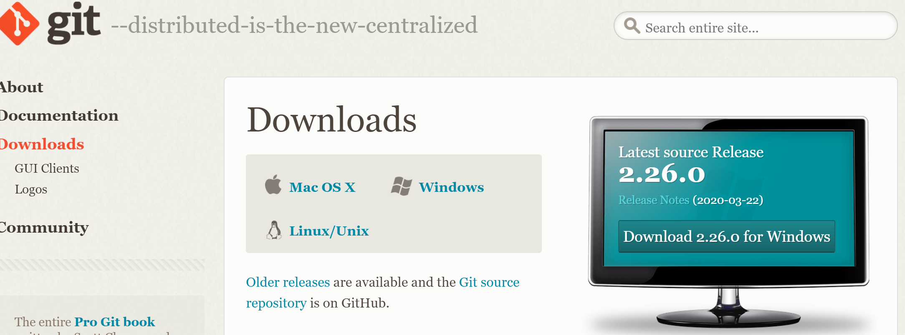

---

相比于博客网站（如：CSDN、简书、Hexo搭建的个人博客等），个人感觉GitBook更能做一些系列型的技术存档与学习，
前者更适合做一些笔记的整理和技术分享，而GitBook的作用相当于将这些笔记做了一些归纳，类似电子书的方式。
对于查询资料和文档整理会更好些，当然，工具的使用因人而异。

<!-- more -->

## 1.环境安装

使用之前，先确保安装了 `Git` 和 `Node.js`。

### 1.1.安装 `Git` 工具

> 传送门：[Git 下载](https://git-scm.com/downloads)



检查环境变量，将 `Git` 加入**系统环境变量**，做一些简单的**配置**：

```bash
# 设定user和email
git config --global user.name "username"
git config --global user.email "email@example.com"

# 创建SSH Key，使用ssh进行上传提交更新时需要公钥，生成获取pubkey
ssh-keygen -t rsa -b 4096 -C "email@example.com"
```

### 1.2.安装 `Node.js` 环境

> 传送门：[Node.js 下载](https://nodejs.org/zh-cn/download/)


选好版本下载、安装完成后，同样将程序加入环境变量。

检查安装结果：
```bash
# 检查 node 和 npm 版本
node -v
npm -v
```

### 1.3.安装 `GitBook`

> 官网：[GitBook](https://www.gitbook.com/)

安装 `GitBook` 插件：
```bash
npm install gitbook-cli -g
```

检查版本：
```bash
$ gitbook -V
CLI version: 2.3.2
GitBook version: 3.2.3
```

## 2.简单使用

### 2.1.初始化图书目录
在图书目录，打开 `gitbash` 或者 `DOS` 窗口，输入：
```bash
$ gitbook init
warn: no summary file in this book
info: create README.md
info: create SUMMARY.md
info: initialization is finished
```

此时，目录下会生成 `README.md` 和 `SUMMARY.md` 这两个文件。

前者是 图书说明文档，后者是目录章节配置文档。
```markdown
<!-- README.md -->
# Introduction

<!-- SUMMARY.md -->
# Summary

* [Introduction](README.md)

```

### 2.2.一些简单操作

> 将要写的文章系列以 mrakdown 的形式生成，放到图书根目录下。

（1）、将 **`.md`** 文件转成页面文件 **`.html`**，运行 **命令**:
```bash
gitbook build
```

此时，根目录中会生成 `_book` 目录，这是网站的静态资源目录。

（2）、本地运行，在网页显示GitBook页面内容，运行 **命令**：
```bash
gitbook serve --port=xxxx
```
此时，浏览器输入网址： `http://localhost:xxxx`，即可打开本地部署的网站。

（3）、命令帮助
命令行输入以下命令，会显示 `gitbook` 的 **帮助信息**：
```bash
gitbook help
```

（4）、安装插件

命令行输入：
```bash
npm install <gitbook-plugin-xxx>
```

（5）、更新和卸载

命令行输入：
```bash
# 更新
gitbook update

# 卸载
gitbook uninstall <version>
```

### 2.3.配置 `book.json` 文件

根目录下，新建文件 **`book.json`**，内容如下：
```json
{
  "title" : "标题",
  "author": "作者",
  "description": "描述",
  "extension": null,
  "generator": "site",
  "language" : "zh-hans",
  "links": {
    "sharing": {
      "all": null,
      "facebook": null,
      "google": null,
      "twitter": null,
      "weibo": null
    },
    "sidebar": {
      "个人主页": "网址"
    }
  },
  "variables": {}
}
```

## 3.`GitBook` 部分常用插件

**<font color="green">`book.json` 插件配置</font>**：
- 插件放置在 **`plugins`** 数组中。
- 插件配置在 **`pluginsConfig`** 字典中。 

### 3.1.`expandable-chapters` 章节导航扩展
```json
{
  "plugins": [
    "expandable-chapters"
  ]
}
```

### 3.2.`copy-code-button` 代码复制按钮
```json
{
  "plugins": ["copy-code-button"]
}
```

### 3.3. `search-plus` 页面搜索
```json
{
  "plugins": ["search-plus"]
}
```

### 3.4.右上角添加 `github` 图标
```json
{
  "plugins": [ 
    "github" 
  ],
  "pluginsConfig": {
    "github": {
      "url": "https://github.com/{github-id}"
    }
  }
}
```

### 3.5.`splitter` 侧边栏宽度可调节
```json
{
  "plugins": ["splitter"]
}
```

### 3.6.`sharing-plus` 分享
```json
{
  "plugins": ["-sharing", "sharing-plus"],
  "pluginsConfig": {
    "sharing": {
      "douban": false,
      "facebook": false,
      "google": true,
      "pocket": false,
      "qq": false,
      "qzone": true,
      "twitter": false,
      "weibo": true,
      "all": [
        "douban", "facebook", "google", "instapaper", "linkedin","twitter", "weibo", 
        "messenger","qq", "qzone","viber","whatsapp"
      ]
    }
  }
}
```

### 3.7.`page-copyright` 页面页脚版权
```json
{
  "plugins" : ["page-copyright"],
  "pluginsConfig" : {
    "page-copyright": {
      "description": "modified at",
      "signature": "你的签名",
      "wisdom": "Designer info",
      "format": "YYYY-MM-dd hh:mm:ss",
      "copyright": "Copyright &#169; 你的名字",
      "timeColor": "#666",
      "copyrightColor": "#666",
      "utcOffset": "8",
      "style": "normal",
      "noPowered": false,
    }
  }
}
```

### 3.8.`anchor-navigation-ex` 悬浮目录与置顶
```json
{
  "plugins" : [ 
    "anchor-navigation-ex" 
  ],
  "pluginsConfig": {
    "anchor-navigation-ex": {
      "showLevel": true,
        "associatedWithSummary": true,
        "printLog": false,
        "multipleH1": true,
        "mode": "float",
        "showGoTop":true,
        "float": {
          "floatIcon": "fa fa-navicon",
          "showLevelIcon": false, 
          "level1Icon": "fa fa-hand-o-right", 
          "level2Icon": "fa fa-hand-o-right",
          "level3Icon": "fa fa-hand-o-right"
        },
        "pageTop": {
          "showLevelIcon": false,
          "level1Icon": "fa fa-hand-o-right",
          "level2Icon": "fa fa-hand-o-right",
          "level3Icon": "fa fa-hand-o-right"
        }
    },
  }
}
```

### 3.9.`donate` 打赏
```json
{
  "plugins" : [ 
    "donate" 
  ],
  "donate": {
    "wechat": "微信图片",
    "alipay": "支付宝图片",
    "title": "",
    "button": "赏",
    "alipayText": "支付宝打赏",
    "wechatText": "微信打赏"
  },
}
```

### 3.10.`mygitalk` 评论插件
```json
{
  "plugins" : [ 
    "mygitalk" 
  ],
  "mygitalk": {
    "clientID": "gitalk id",
    "clientSecret": "密钥",
    "repo": "",
    "owner": "GitHub id",
    "admin": ["username"],
    "distractionFreeMode": false
  },
}
```


## 4.安装 `gitbook` 插件

命令行输入：
```bash
gitbook install
```
可能会比较慢，等待一会儿，安装完成后再重新构建页面和启动服务。


> 参考： [GitBook 插件整理](https://www.jianshu.com/p/427b8bb066e6)